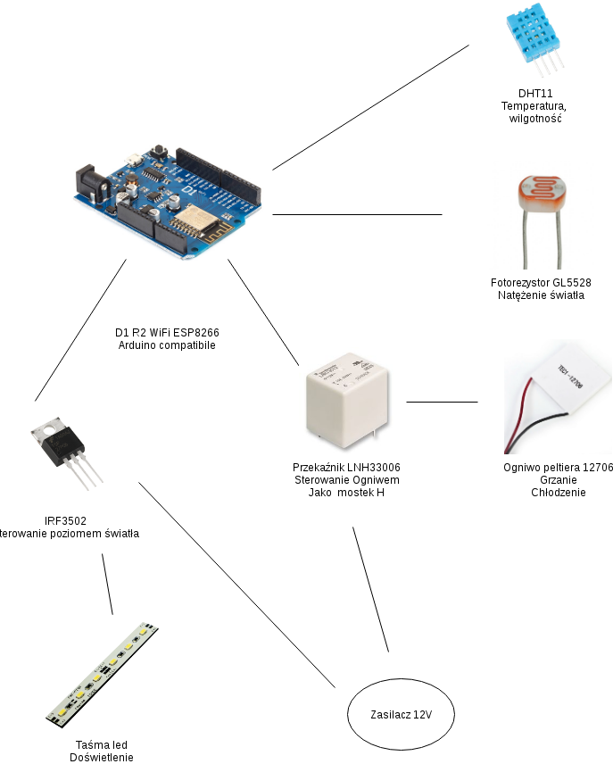

# Schematy hardware:

## Schemat elektroniczny:

Projekt elektroniczny został stworzony w środowisku EasyEda, link do projektu:
https://easyeda.com/stefanczykdk/projekt-zespo-owy-parapetowa-szklarnia 

Schemat blokowy:

  

Schemat elektroniczny:

  

